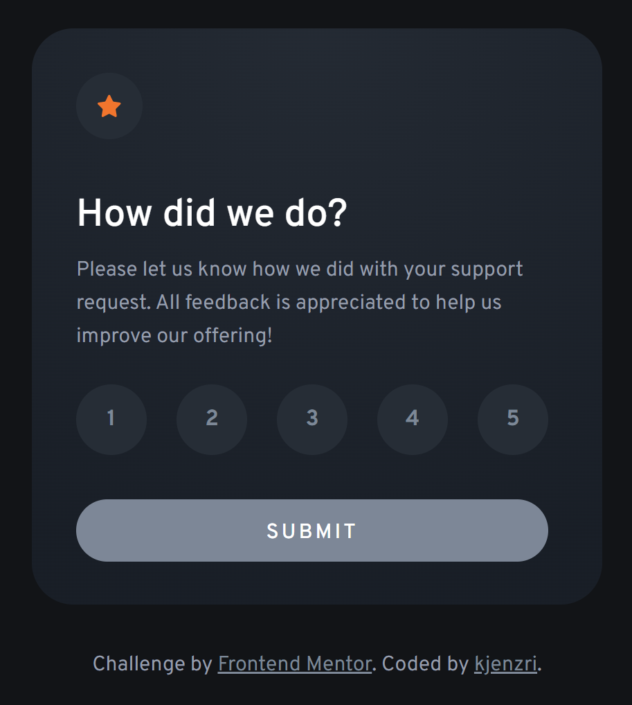
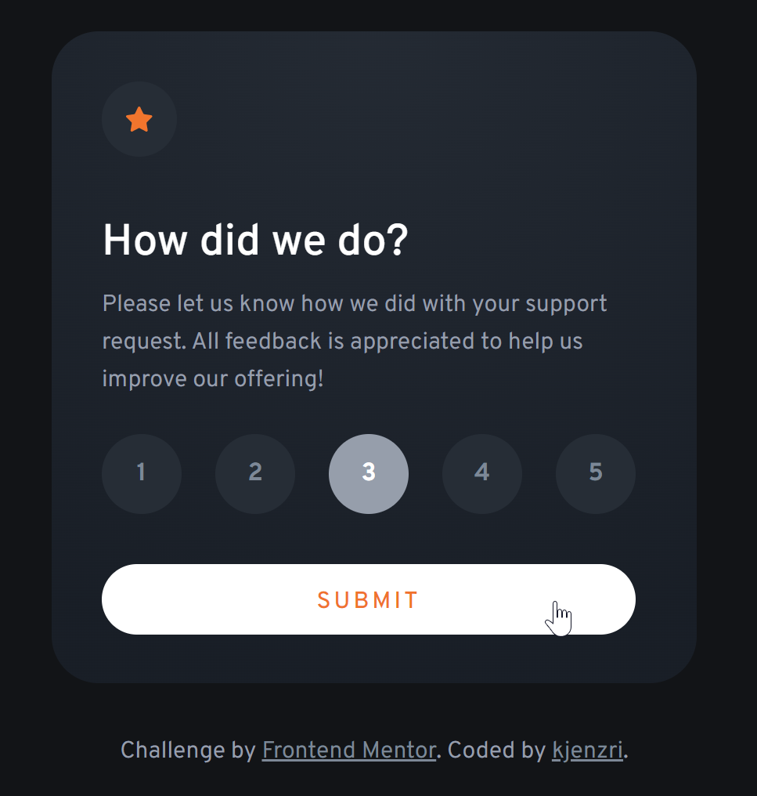
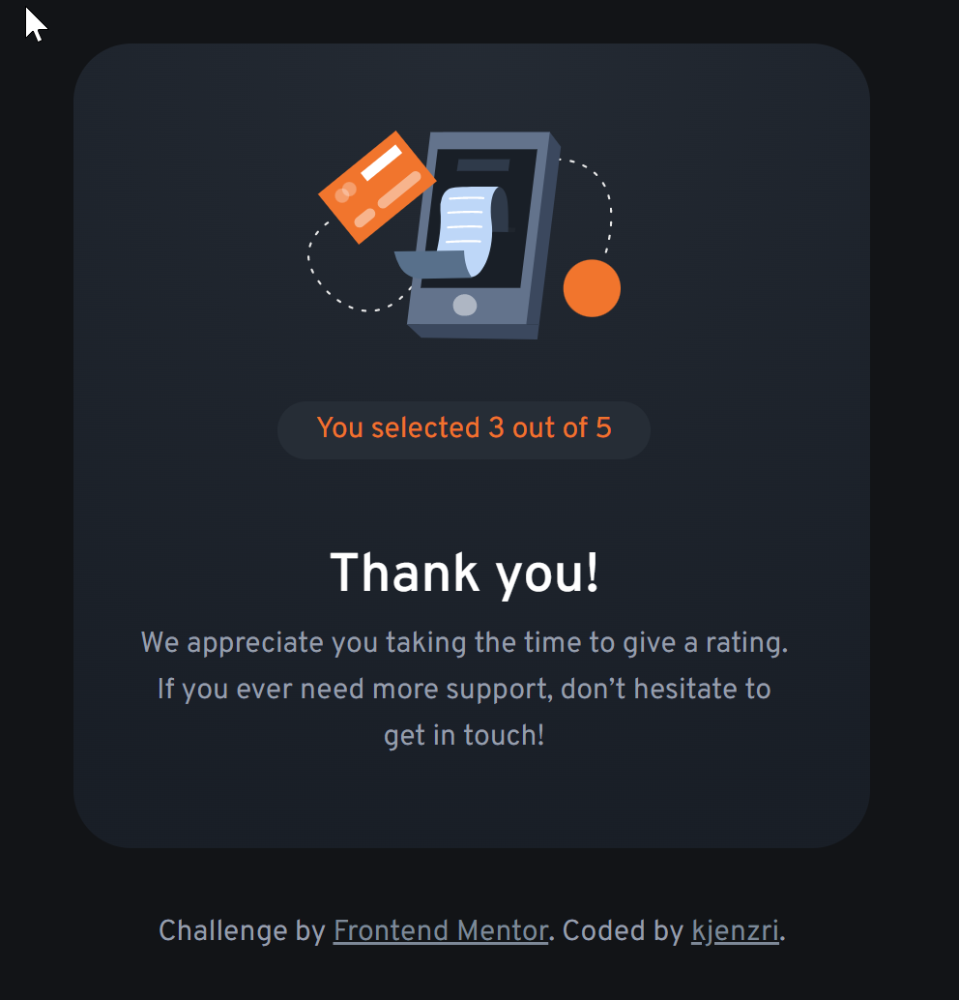

# Frontend Mentor - Interactive rating component solution

This is a solution to the [Interactive rating component challenge on Frontend Mentor](https://www.frontendmentor.io/challenges/interactive-rating-component-koxpeBUmI). Frontend Mentor challenges help you improve your coding skills by building realistic projects. 

## Table of contents

- [Screenshot](#screenshot)
- [Links](#links)
- [Built with](#built-with)
- [Useful resources](#useful-resources)
### Screenshot

### Links

- Solution URL: [Add solution URL here](https://github.com/kjenzri/frontend-mentor-chanllenges/tree/main/interactive-rating-component)
- Live Site URL: [Add live site URL here](https://kjenzri.github.io/frontend-mentor-chanllenges/interactive-rating-component/)

### Built with

- Semantic HTML5 markup
- Emmet
- Bem naming
- CSS custom properties
- Flexbox
- Vanilla JavaScript

### Useful resources

- [Bem naming](https://getbem.com/naming/) - This helped me to use bem naming
