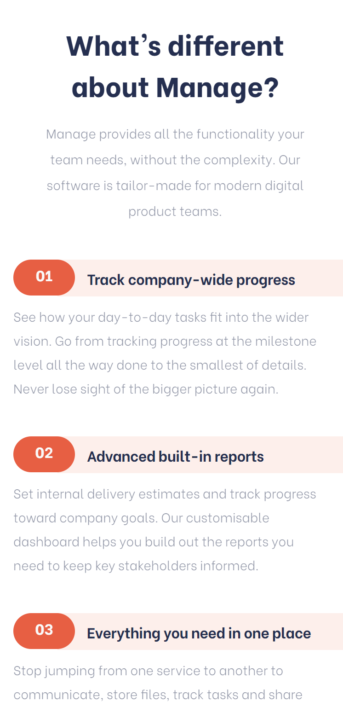

# Frontend Mentor - Manage landing page solution

This is a solution to the [Manage landing page challenge on Frontend Mentor](https://www.frontendmentor.io/challenges/manage-landing-page-SLXqC6P5). Frontend Mentor challenges help you improve your coding skills by building realistic projects. 

## Table of contents

- [Overview](#overview)
  - [The challenge](#the-challenge)
  - [Screenshot](#screenshot)
  - [Links](#links)
- [Built with](#built-with)
- [What I learned](#what-i-learned)
- [Author](#author)

## Overview

### The challenge

Users should be able to:

- View the optimal layout for the interface depending on their device's screen size
- See hover and focus states for all interactive elements on the page
- Customize ordred list
- Swipe in mobile layout

### Screenshot

### Links

- [Solution URL](https://github.com/kjenzri/frontend-mentor-challenges/tree/main/landing-page)
- [Live Site URL](https://kjenzri.github.io/frontend-mentor-challenges/landing-page)

## My process

## Built with

- Semantic HTML5 markup
- CSS custom properties
- Flexbox
- CSS Grid
- Vite
- Javascript

## What I learned

The more important knowledge that I've acquired is about position relative and absolute, use ::before pseudo-element, customize list marker, use Javascript to swipe.

## Author

- Website - [kjenzri GitHub](https://github.com/kjenzri)